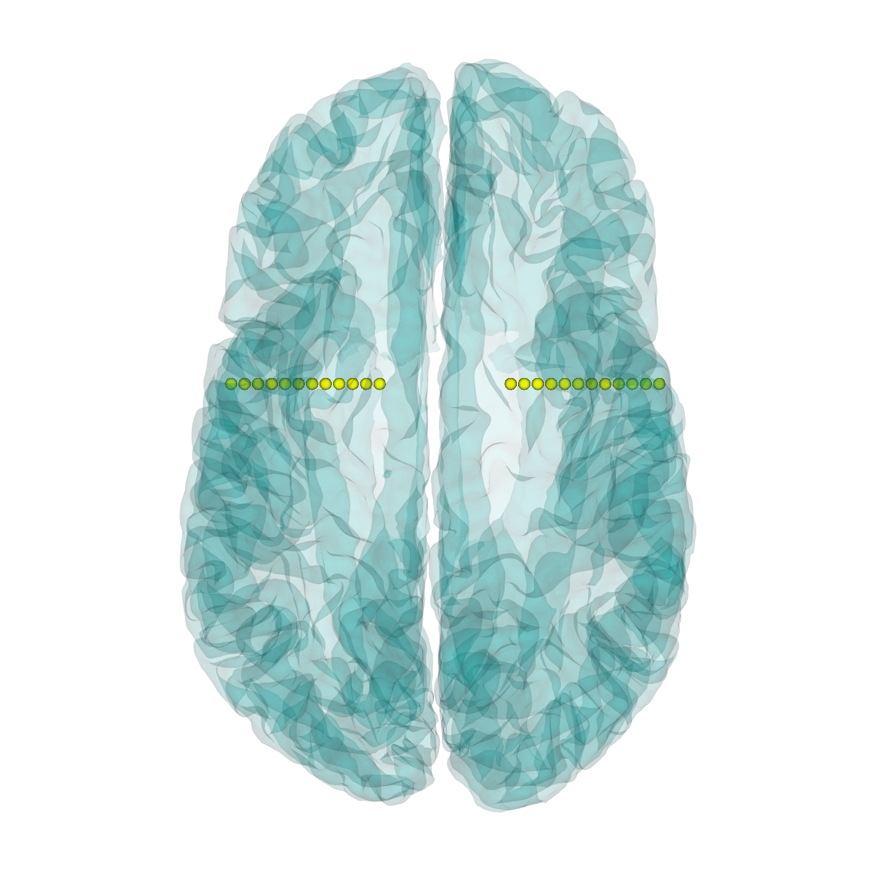
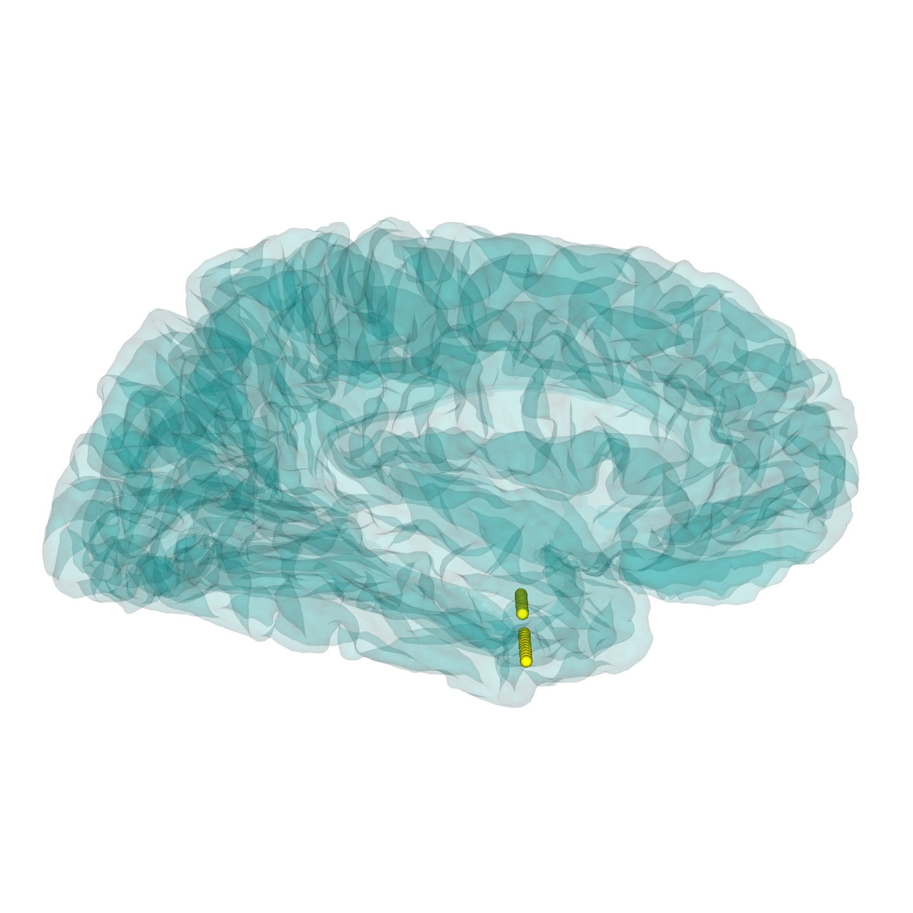
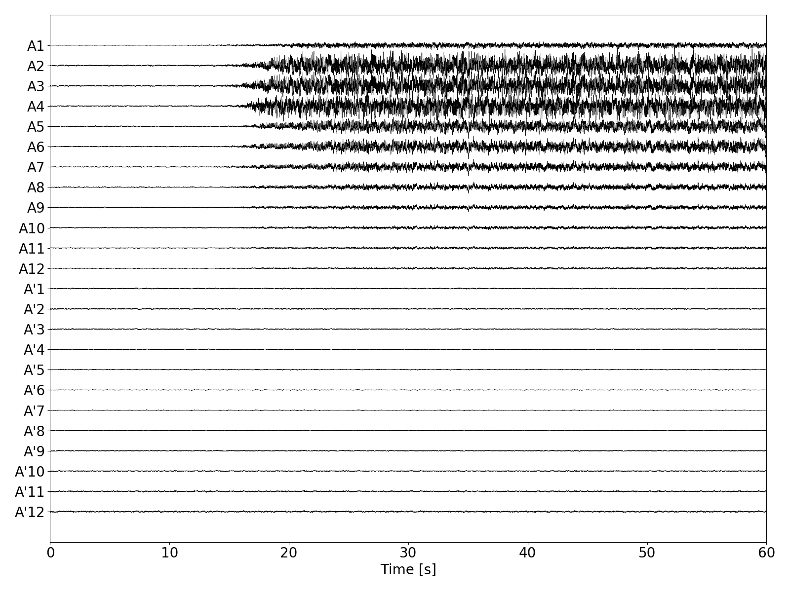
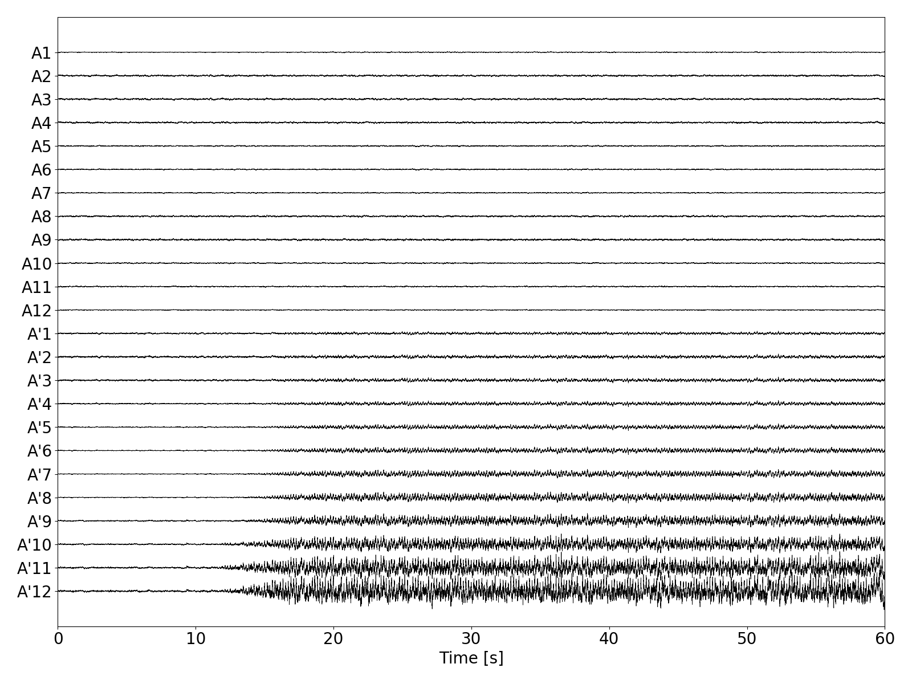

# taa-pattern

Code for the analysis and simulations in [1], investigating the mechanisms behind the theta-alpha activity (TAA) electrographic pattern in intracranial recordings of epileptic seizures.

## Environment

Python 3.6 or higher with multiple scientific and neuroscientific libraries is necessary. The file `env.yml` contains the specification of the Python environment.

## Data

Due to the nature of the patient data, the data used in the study are not publicly available, but are available upon request to the authors. 
We however supply substitute data to allow running the code: `data/Geometry/id001/` contains the cortical surface of FreeSurfer's sample subject Bert, with two hand-placed electrodes.
The directory `data/Recordings/id001/` contains two simulated seizures, generated using the aforementioned cortical surface and spreading seizure model described in the paper.
To use the code with your data, place the data in the directory in the same format with sequentially numbered subjects (`id001`, `id002`, ...).

 

 

 

## Code

The code is structured as follows:

- `util/` contains the core of the simulation and analysis code. In particular, `util/sim.py` contains function related to the seizure simulations, and `util/post.py` contains the TAA detection functions.
- `notebooks/` contains the IPython notebooks for generation of the figures in the paper.
- `scripts/` contains example scripts to run and analyze the simulations.
  - `viz.py` vizualizes subject's cortical surface and the placement of the implanted electrodes. Run with `python scripts/viz.py` from the project directory.
  - `runsim.py` runs one seizure simulation on the indidual cortical surface. Run with `python scripts/runsim.py` from the project directory.
  - `detect-taa.py` finds and analyzes the individual TAA instances and TAA groups in a recordings.
- `main.smk` is the Snakemake file describing the workflow of the entire study. To execute the workflow, run with `snakemake -s main.smk all` from the project directory. Note however that the execution requires significant computational resources (on the order of tens of CPU hours for a single subject) since the implementation is not particularly efficient, and the use of appropriate HPC resources might be necessary.

## References

[1] Sip, V., Scholly, J., Guye, M., Bartolomei, F., Jirsa, V. Evidence for spreading seizure as a cause of theta-alpha activity electrographic pattern in stereo-EEG seizure recordings. bioRxiv, 2020. https://doi.org/10.1101/2020.07.22.215442
